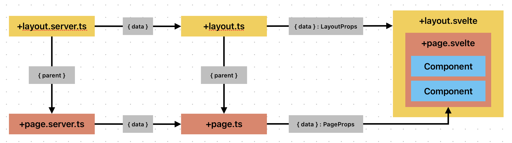

## 데이터 흐름과 페이지의 구성

- `+page`
    - `+page.svelte`
        - 앱의 페이지 정의
    - `+page.ts`
        - 페이지가 렌더링 되기 전에 데이터 로딩 
        - client, server 모두 동작
    - `+page.server.ts`
        - 페이지가 렌더링 되기 전에 데이터 로딩
        - server 에서만 동작
        - 보안이 중요한 데이터 작업 수행 (파일 시스템 접근, 비공개 키값, DB 접근 등)

- `+layout`
    - `+layout.svelte`
        - 경로별 페이지 적용 레이아웃 정의
    - `+layout.ts`
        - 레이아웃이 렌더링 되기 전에 데이터 로딩 
        - client, server 모두 동작
    - `+layout.server.ts`
        - 레이아웃이 렌더링 되기 전에 데이터 로딩
        - server 에서만 동작
        - 보안이 중요한 데이터 작업 수행 (파일 시스템 접근, 비공개 키값, DB 접근 등)

### Universal vs Server
- load 함수는 서버와 브라우저 모두에서 실행되는 +page.ts, +layout.ts와 서버에서만 실행되는 +page.server.ts, +layout.server.ts 두 가지가 있다.
- 기본적으로 범용 load 함수는 사용자가 페이지를 처음 방문할 때 SSR 중에 서버에서 실행되고, 그런 다음 하이드레이션 중에 다시 실행되어 페치 요청의 응답을 재사용한다.
- load 함수가 실행 환경에 따라 분리 되는 구조는 함수 작동의 관심사 분리를 위해 이루어 진다.
    - Server측의 load는 `어떻게` 데이터를 `안젼하게` 가져올 것인가?
    - Client측의 load는 `무엇을` 페이지에 `보여줄것`인가?
    - 정리하자면 Server load 함수는 데이터의 원천 소스를 다루고 `Client load`함수는 server load로 부터 데이터를 받아 최종적으로 페이지를 구성하기 위한 데이터를 가공하고 필터링 하는 게이트 웨이 역할을 한다.
    
### Input
- 두 실행 환경의 load 함수가 한 페이지에 동시에 존재할 경우 server load 함수의 반환 값은 client load 함수의 data 인자 값이 된다. 두 실행 환경의 load 함수는 대부분의 인자를 공유하지만 실행 환경에 따라 특별한 인자를 가진다.   
    - [load 함수의 실행환경별 인자](https://ballboydev.github.io/post/119#bm-61)

### Output
- Universal load와 Server load 함수의 반환 값은 각 함수가 실행되는 환경과 네트워크 경계의 존재 유무 때문에 발생한다.
    - Universal load: 서버와 블라우저, 즉 데이터를 소비하는 컴포넌트와 같은 공간에서 실행될 수 있어, 네트워크 전송을 위한 직렬화 과정이 필요 없기에 거의 모든 유형의 값을 반환할 수 있다.
    - Server load: 오직 서버에서만 실행되며, 그 결과는 네트워크를 통해 브라우저로 전송된다. 따라서 반환 값은 반드시 네트워크로 전송 가능한 형태, 즉 직렬화가 가능한 데이터 여야만 한다
    - [load 함수의 실행환경별 반환 값](https://ballboydev.github.io/post/119#bm-70)